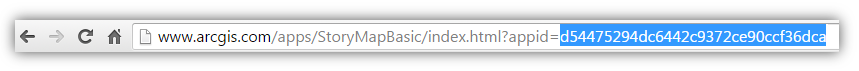

# Story Map Basic

The Story Map Basic app is a simple map viewer with a minimalist user interface. Apart from the title bar and an optional legend, the map fills the screen. Use this app to let your map speak for itself. Your users can click features on the map to get more information in pop-ups.

[View live app here](http://links.esri.com/storymaps/story_map_basic_overview_1)

 |
[Download](http://links.esri.com/storymaps/story_map_basic_zip)

This application is part of the ArcGIS Online and can be accessed from the ArcGIS Online's map viewer Share window. 
This repository provides the application source code for developers that want to customize the application.

For more information, including a gallery of examples and a step-by-step tutorial, please see the [Map basic](http://storymaps.arcgis.com/en/app-list/basic/) page on the [Esri Story Maps website](http://storymaps.arcgis.com/).

## Instructions
First create your Map Basic in ArcGIS Online using the [step-by-step tutorial](http://storymaps.arcgis.com/en/app-list/basic/tutorial/).
Once your story is ready, you have to find its ID in ArcGIS Online. The ID is a 32 character string that you will find in your web browser's address bar when you are viewing your series.

1. [Download the application](http://links.esri.com/storymaps/map_series_template_zip)
2. Deploy the application on your webserver. See [FAQ](#how-to-deploy-the-application-on-a-web-server) for details
3. Edit `config\defaults.js`, find the `appid` property on line 21 and paste in your application ID
4. Navigate to index.html (e.g., `http://127.0.0.1/MapBasic/index.html`)

Enjoy!
You can continue to use the configuration interface in ArcGIS Online to modify your story.

*If you are using Portal for ArcGIS, please edit `config\defaults.js` > `sharinghost` at line 63 to configure the application. For exemple if you Portal is accessible at `acme.com/gis/`, the value should be `"sharinghost": location.protocol + "//" + "acme.com/gis/"`
Optionally you can also [configure the application](#can-the-template-be-used-offline) to use the ArcGIS API for JavaScript included on your Portal.*

Alternatively, the application can be configured with a webmap id instead of an application id (see `config\defaults.js` > `webmap` on line 22. 
In that case, the configuration all the configuration has to be done through through `config\defaults.js`.

## Feedback / support
We would love to hear from you!
* [StoryMaps Website](http://storymaps.arcgis.com/)
* [Let us know about your application](http://storymaps.arcgis.com/en/gallery/submission-form/)
* [Story Maps forum on GeoNet](http://links.esri.com/storymaps/story_maps_geonet)
* [@EsriStoryMaps](http://twitter.com/EsriStoryMaps)
* [ArcGIS Blog](http://blogs.esri.com/esri/arcgis/)

When you contact us, don't hesitate to include a link to your application to make it easier for us to understand what you are working on.

## FAQ

### What are the supported browsers?
The application is supported on Internet Explorer 9 and above, Chrome, Firefox, Safari and the most recent tablet and smartphone devices.

### Can I use the template without ArcGIS Online or Portal for ArcGIS?
Yes, by setting `app/templatesConfig.js` > `useLocalWebmap` to `true`, the application will load the local definition of a webmap defined stored in `demoMap.js`. 
To modify this file, and add your own layer, see the [web map specification](http://resources.arcgis.com/en/help/arcgis-web-map-json/) or inspect the network request when loading a map.

### Can the template be used offline?
Yes, by using Portal for ArcGIS and configuring the template to use the ArcGIS API for Javascript included with the Portal. 

Change all references to the ArcGIS API for JavaScript in index.html to refer to your local copy of the API. 
Search for the references containing "//js.arcgis.com/3.15" and replace this portion of the reference with the url to your local install.
For example: "//acme.com/gis/jsapi/jsapi" where `gis` is the name of your Web Adaptor.

## Requirements
* Notepad or HTML editor
* Some background with HTML/CSS/Javascript
* Experience with the [ArcGIS Javascript API](http://links.esri.com/javascript) is helpful

## Issues
Find a bug or want to request a new feature?  Please let us know by submitting an issue.

## Contributing
Esri welcomes contributions from anyone and everyone. Please see our [guidelines for contributing](https://github.com/esri/contributing).

## Licensing
Copyright 2013 Esri

Licensed under the Apache License, Version 2.0 (the "License");
you may not use this file except in compliance with the License.
You may obtain a copy of the License at

   http://www.apache.org/licenses/LICENSE-2.0

Unless required by applicable law or agreed to in writing, software
distributed under the License is distributed on an "AS IS" BASIS,
WITHOUT WARRANTIES OR CONDITIONS OF ANY KIND, either express or implied.
See the License for the specific language governing permissions and
limitations under the License.

A copy of the license is available in the repository's [LICENSE.txt](LICENSE.txt) file.

